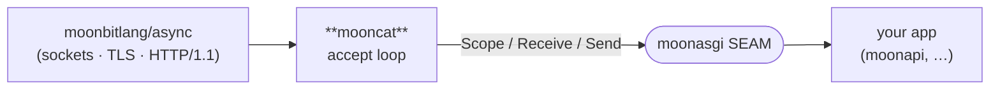

<div align="center">

# mooncat

**A native ASGI 3.0 server for MoonBit — `← uvicorn`.**

[](https://github.com/moonbitstack/mooncat/actions/workflows/ci.yml)
[](./LICENSE)
[](https://mooncakes.io/docs/Lfan-ke/mooncat)

</div>

`mooncat` runs a [`moonasgi`](https://github.com/moonbitstack/moonasgi) application over a real network socket. It sits between `moonbitlang/async`'s native HTTP transport and the ASGI SEAM: it accepts connections, turns each request into a `Scope` + `Receive` + `Send`, and drives your app — exactly the role `uvicorn` plays for Python.



## Quickstart

```moonbit
// An ASGI app: respond 200 with a text body.
let app : @moonasgi.AsgiApp = (_scope, _receive, send) => {
  send(@moonasgi.Event::HttpResponseStart(
    status=200, headers=[("content-type", "text/plain")]))
  send(@moonasgi.Event::HttpResponseBody(
    body=b"Hello from mooncat!", more_body=false))
}

// Serve it (inside an async context / task group):
@mooncat.serve(app, host="127.0.0.1", port=8000)
```

`serve` blocks in a keep-alive accept loop until its task is cancelled. Each request is bridged faithfully: the method/path/query/headers become an `http` `Scope`, the request body streams through `Receive`, and `HttpResponseStart` / `HttpResponseBody` events are written back via the connection.

## HTTPS / TLS

`serve_tls` serves the same ASGI app over TLS (← uvicorn's `--ssl-certfile` / `--ssl-keyfile`):

```moonbit
@mooncat.serve_tls(app,
  certificate_file="certs/cert.pem",  // PEM cert  (OpenSSL platforms)
  private_key_file="certs/key.pem",   // PEM key   (OpenSSL platforms)
  pfx_file="certs/dev.pfx",           // PKCS#12   (Windows / SChannel)
  port=8443)
```

Each accepted connection completes a real TLS handshake (`@tls.Tls`), then a **self-built, transport-agnostic HTTP/1.1 codec** — request-line + header parser and a response writer that frames single-shot replies with `Content-Length` and streamed replies with `Transfer-Encoding: chunked` — drives the moonasgi app over the encrypted stream, with keep-alive and the lifespan protocol intact. Proven end-to-end by a real `@http` TLS client doing `GET` over `https://` and asserting `200` + body in CI. Regenerate the throwaway localhost test cert with `scripts/gen_test_cert.sh`.

**Design boundaries** (honest, not stubs):

- The certificate is supplied as **PEM** on OpenSSL platforms (Linux/macOS) and as a **PKCS#12** `.pfx` on Windows (SChannel), because that is what each `moonbitlang/async` TLS backend accepts; `serve_tls` selects the right form at compile time.
- `moonbitlang/async` exposes its **server-side** TLS constructor as `#internal` ("for internal testing only") — it is the only such entry point, and the async suite itself serves HTTPS through it — so mooncat opts into that one alert (`warnings = "-alert_internal"` in `moon.pkg`) and will migrate the moment a public API lands.
- **WebSocket-over-TLS (`wss://`) is not bridged**: the async websocket upgrade needs an `@http.ServerConnection`, which is welded to `@socket.Tcp` and cannot wrap a `@tls.Tls` stream. Plaintext `serve` keeps full WebSocket support; this is a transport-capability boundary, not a behavioural choice.

## Process model

`serve_graceful` runs the app under uvicorn's process model — a graceful shutdown and a `--reload` file watcher:

```moonbit
let handle = @mooncat.ShutdownHandle::new()
g.spawn(() => @mooncat.serve_graceful(app, @mooncat.Config::new(port=8000), handle~))
// … later, from anywhere:
handle.shutdown()   // stop accepting → drain in-flight → lifespan shutdown → close
```

`handle.shutdown()` blocks until the port is free again. The sequence is fixed and verified end-to-end in CI: a slow request that is still in flight when shutdown fires is allowed to finish (the client still sees `200`) **before** lifespan shutdown runs, and the listener is closed only afterwards — a real socket integration test pins the ordering, and a mutation test (running lifespan shutdown before the drain) turns it red. A shutdown can also come from a signal: wire `@signal.set_global_cancellation_signals` and mooncat runs lifespan shutdown + close under `protect_from_cancel` on the way down.

`serve_graceful` drives each connection through the same request path `serve` does — it builds a real `@http.ServerConnection` over the accepted socket and reads requests off it directly, rather than owning a private codec. So **WebSocket upgrades work under graceful serve too**: a `ws://` route gets the full frame↔`Event` bridge, verified in CI by a real `@websocket` client doing a text + binary round-trip against a `serve_graceful` server.

`reload_watch(dir, on_reload)` watches a source tree with `@fs.Watcher` and fires `on_reload` on each change — hook it to a `ShutdownHandle` to turn a file save into a graceful restart.

**Multi-worker boundary** (honest, not a stub): uvicorn's `--workers` forks N OS processes that share the port via `SO_REUSEPORT`. `moonbitlang/async` exposes neither `SO_REUSEPORT` nor a fork primitive, and its event loop permits only one outstanding `accept` per listener (a second concurrent `accept` on the same handle aborts), so N in-process acceptor tasks aren't expressible. mooncat serves from one acceptor that spawns a concurrent handler per connection — the same concurrency a single uvicorn worker gives on its one event loop. Multi-process fan-out lands when the async layer exposes `SO_REUSEPORT` or fork.

## HTTP/2 (h2c)

`serve_h2c` serves the same ASGI app over **HTTP/2 cleartext** — the prior-knowledge, no-TLS HTTP/2 profile a client reaches with `curl --http2-prior-knowledge` or a gRPC client:

```moonbit
@mooncat.serve_h2c(app, host="127.0.0.1", port=8000)
```

The transport is [`moonrpc`](https://github.com/moonbitstack/moonrpc)'s self-built HTTP/2 stack — the same RFC 7540 frame layer and RFC 7541 HPACK engine that carries real gRPC there. mooncat binds it to ASGI: it reads the client connection preface + SETTINGS, HPACK-decodes each request's HEADERS block into an `Http` `Scope` (the `:method` / `:path` / `:scheme` / `:authority` pseudo-headers plus the ordinary headers), streams request DATA to the app as the `Receive` body, and encodes the response — a HEADERS frame with the `:status` pseudo-header, then DATA — back over the connection. Requests multiplex on their own stream ids, and the response DATA is split to the peer's maximum frame size and clamped to the connection- and stream-level send windows, resuming on `WINDOW_UPDATE` (RFC 7540 §6.9).

Proven end to end in CI by a **real HTTP/2 (h2c) client** built on `@socket.Tcp` and the same frame + HPACK codecs: it GETs a route and reads `200` + body, POSTs a body the app echoes, drives two multiplexed streams on one connection, and — with a deliberately small advertised window — checks the server clamps each DATA frame to the granted window. The same greet chain runs over h2c too: a real [`moonapi`](https://github.com/moonbitstack/moonapi) app answers a genuine HTTP/2 GET, the router resolving the path decoded out of the HPACK block.

`h2c` rather than `h2`-over-TLS because the `moonbitlang/async` TLS layer exposes no ALPN, so the protocol can't be negotiated on a TLS connection yet; h2c is the direct, ALPN-free path. HTTP/3 (QUIC) is a separate later self-build.

## Status

`v0` — HTTP/1.1 request → ASGI `Scope`/`Receive`/`Send` → response is **working and verified by a real socket round-trip in CI** (a server task answers a live `@http.get`). Landed and CI-verified alongside it:

- the **lifespan** protocol — the app runs once under a `Lifespan` scope, `startup` is driven before the listener binds and `shutdown` on the way out, even under cancellation;
- the **full WebSocket frame↔`Event` bridge** — a `Connection: upgrade` + `Upgrade: websocket` handshake becomes a `websocket` `Scope` driven through the moonasgi SEAM: `receive()` emits `websocket.connect` then real inbound text/binary frames as `WebSocketReceive` (streamed through the `Message`-as-`Reader`, so fragments reassemble) and a peer close as `WebSocketDisconnect(code)`; `send()` turns `WebSocketAccept` into the deferred 101 handshake, `WebSocketSendText`/`WebSocketSendBytes` into message frames, and `WebSocketClose(code, reason)` into a close frame. Rejecting before accept answers `403`; ping/pong are auto-handled at the protocol layer (as in uvicorn). The receive side enforces RFC 6455 rather than trusting the peer: a set RSV bit, a reserved opcode, an unmasked client frame and a malformed control frame each fail the connection with `1002`, a payload past `ws.max_size` with `1009` — checked before the payload is read, so a 64-bit length is never truncated into a short allocation — invalid UTF-8 in a text message with `1007`, and an inbound close is echoed per §5.5.1. Proven by a **real `@websocket` client** doing a full text + binary round-trip and a clean close in CI;
- a `Config` in the shape of uvicorn's, and honoured rather than merely recorded: `dual_stack`, `reuse_addr`, per-server response `headers`, `max_connections`, `allow_failure`, `timeout_keep_alive` (an idle keep-alive connection is dropped, on both keep-alive loops), `limit_max_requests` (the server stops itself, on the plain acceptor and the graceful one), `limit_concurrency` (uvicorn's `503` rather than a queue), `max_head_size` (uvicorn's `h11_max_incomplete_event_size`), `date_header`, `proxy_headers` / `forwarded_allow_ips`, and `ws.max_size`. `backlog` is the one field that does nothing: `@socket.TcpServer` calls `listen()` itself with a fixed depth and exposes no way to change it. Chunked request/response framing is handled by the codec.

mooncat also **hosts a real [`moonapi`](https://github.com/moonbitstack/moonapi) app end to end**: a CI integration test builds a `moonapi` `App` with a typed `/greet/:name` route, serves it through `serve`, and a real `@http` client `GET`s it and asserts the JSON body and `200` (and a `404` on a route miss). That's the server half of the suite's greet chain — the two repos cooperating over a live socket, not just compiling together.

**HTTPS/TLS serving**, the **graceful-shutdown + `--reload` process model**, and **HTTP/2 (h2c) serving** landed too — see the sections above. Roadmap, transliterated from uvicorn feature-by-feature: subprotocol echo into the 101 response on the async-transport path (awaits a transport hook), further TLS detail (ciphers/mTLS), `h2` over TLS once the async layer exposes ALPN, multi-process prefork once it exposes `SO_REUSEPORT` or fork, `backlog` once `TcpServer` takes one, and the remaining WebSocket knobs — `ws-ping-interval` / `ws-ping-timeout` / `ws-max-queue` need a reader that can be interrupted between messages and resumed, and `ws-per-message-deflate` needs a raw DEFLATE codec the async `gzip` package does not expose.

## Native only

The `moonbitlang/async` HTTP **server** is native-only (Linux/macOS) — there is no JS server backend — so `mooncat` builds and runs on the `native` target. CI covers `ubuntu` + `macos`.

## License

Apache-2.0.
